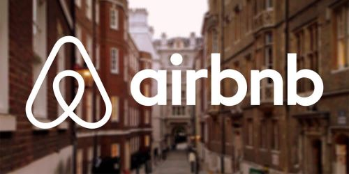

# Gavin's Portfolio

## About Me

Hello! I'm Gavin Jaynes. I'm a Computer Science student at Boise State University with a focus in Machine Learning, building a strong foundation in software development, data workflows, and technical problem-solving. My current work centers around Node.js, JavaScript, SQL, and R, tools I’ve used to build RESTful APIs and explore real-world datasets including an in-depth project on global cancer rates. I also bring hands-on experience from the field as a former test technician in imaging hardware where I learned the value of precision and systems thinking.

This portfolio reflects my learning journey, personal projects, and growing technical skillset. I’m always open to collaboration, feedback, or connecting with others in tech. Feel free to reach out any time.

Thanks for visiting!

## Table of Contents

1. [Project 1: Vidly - RESTful API](#project-1-vidly-restful-api)
2. [Project 2: Exploring Cancer Rates by Country](#project-2-exploring-cancer-rates-by-country)
3. [Project 3: Cleaning Basics with R](#project-3-cleaning-basics-with-r)
4. [Project 4: Exploring Airbnb Stay Patterns in New York City (2019) using Open Data](#project-4-exploring-airbnb-stay-patterns-in-new-york-city-2019-using-open-data)
5. [Project 5: API Weather Application](#project-5-api-weather-application)
6. [Project 6: Code Web Page Calculator](#project-6-code-web-page-calculator)
7. [Skills and Tools](#skills-and-tools)
8. [Contact Information](#contact-information)

## Project 1: Vidly - RESTful API

- **Description**: In this project, I built a robust RESTful API using Node.js, Express, and Joi. The project involved setting up the environment, creating endpoints for CRUD operations on movie genres, and ensuring data integrity through validation.
- **Key Features**:
  - **Express Middleware**: Utilized `express.json()` to handle JSON requests.
  - **CRUD Operations**: Implemented endpoints for managing movie genres.
  - **Data Validation**: Used Joi for rigorous input validation.
  - **Endpoint Testing**: Employed Postman for comprehensive testing.
- **Skills Used**: Node.js, Express, Joi, Postman.
- **Code**: [Link to project](https://github.com/gavin-jaynes/Gavin-s_Portfolio/blob/main/Vidly-RESTful-API)
- **Results**: Demonstrated practical skills in building and maintaining scalable APIs, validating data, and creating well-tested applications.

---

## Project 2: Exploring Cancer Rates by Country

- **Description**: Conducted exploratory data analysis (EDA) on cancer rate data to uncover trends and patterns, including an examination of ozone-cancer correlations.
- **Skills Used**: Google Sheets, Tableau, Data Cleaning, Exploratory Data Analysis.
- **Code**: [Link to project](https://github.com/gavin-jaynes/Gavin-s_Portfolio/blob/main/EDA%3ACancer-Ozone_Correlation_project)
- **Results**: Provided visual insights into cancer rates across different regions and researched environmental factors affecting cancer rates.

---

## Project 3: Cleaning Basics with R

- **Description**: Focused on data cleaning techniques using R to prepare datasets for analysis, ensuring data quality and consistency.
- **Skills Used**: R Programming, Data Cleaning, Data Exploration, Problem-Solving.
- **Code**: [Link to project](https://github.com/gavin-jaynes/Gavin-s_Portfolio/blob/main/Cleaning%20Basics%20with%20R)
- **Results**: Implemented data cleaning procedures, addressed missing values and duplicates, and saved the cleaned data for further analysis.

---

## Project 4: Exploring Airbnb Stay Patterns in New York City (2019) using Open Data

- **Description**: Analyzed Airbnb stay patterns in NYC for 2019 using open data to uncover trends and insights into accommodation preferences and pricing.
- **Skills Used**: Data Analysis, Visualization, Statistical Analysis.
- **Code**: [Link to project](https://github.com/gavin-jaynes/Gavin-s_Portfolio/blob/main/Analyzing%20Airbnb%20Stays%20in%20NYC%20(2019))
- **Results**: Produced valuable insights into Airbnb stay patterns, contributing to a better understanding of the NYC rental market.

---

## Project 5: API Weather Application

.png)

- **Description**: This project showcases a weather web application developed using HTML, CSS, and JavaScript. It includes API integration with OpenWeatherMap to deliver real-time weather updates and forecasts.
- **Skills Used**: HTML, CSS, JavaScript, API Integration, Debugging.
- **Code**: [Link to project](https://github.com/gavin-jaynes/Gavin-s_Portfolio/blob/main/API%20Weather%20Application)
- **Results**: Delivered a functional and visually appealing weather app with hands-on experience in API integration and secure data access.

---

## Project 6: Code Web Page Calculator

- **Description**: A dynamic web calculator built using HTML, CSS, and JavaScript. This project enhanced my coding skills and problem-solving abilities.
- **Skills Used**: HTML, CSS, JavaScript, Debugging, Object-Oriented Programming (OOP).
- **Code**: [Link to project](https://github.com/gavin-jaynes/Gavin-s_Portfolio/blob/main/Code%20Web%20Page%20Calculator%20project)
- **Results**: Demonstrated proficiency in web development technologies through the creation of a seamless web calculator.

---

## Skills and Tools

- **Programming Languages**: JavaScript, SQL, R
- **Web Technologies**: Node.js, RESTful APIs
- **Data Visualization**: Tableau, ggplot2
- **Tools**: Git, GitHub, MS Excel, Google Sheets
- **Packages**: tidyverse, ggplot2, dplyr, tidyr, readr
- **Databases**: BigQuery

---

## Contact Information

- **LinkedIn**: [Gavin's LinkedIn Profile](https://www.linkedin.com/in/gavin-j/)

Feel free to connect with me on LinkedIn or reach out via email if you'd like to discuss projects, opportunities, or data analysis. Let's work together to create innovative solutions!

